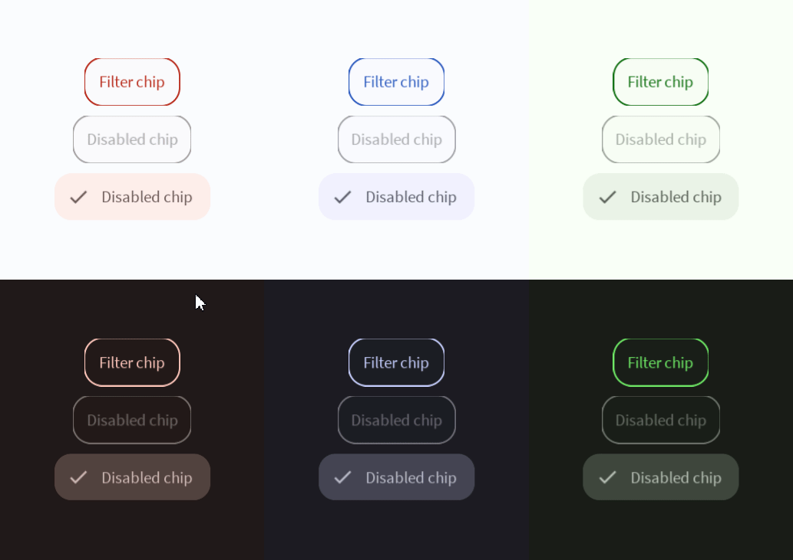

# Filter



A filter chip is a small switch that allows for hiding / revealing of elements. Read more (here)[https://m3.material.io/components/chips/overview].
# Constructors


## new
This function is a native constructor, with verbosity allowing for control over every configurable property at the cost of a less convenient calling.

### Parameters
- **onClick**: (isSelected: boolean) -> ()
- **isInitiallySelected**: boolean
- **text**: string
- **textColor**: Color3
- **disabledTextColor**: Color3
- **fillTextColor**: Color3
- **disabledFillTextColor**: Color3
- **disabledFillColor**: Color3
- **isEnabled**: boolean
- **elevation**: number
- **schemeType**: Enums.SchemeType
- **fontData**: FontData
- **scale**: number


### Usage

**No Framework**
```luau
local onClick: (isSelected: boolean) -> () = function(isSelected: boolean) end
local isInitiallySelected: boolean = false
local text: string = "Filter"
local textColor: Color3 = Color3.new()
local disabledTextColor: Color3 = Color3.new()
local fillTextColor: Color3 = Color3.new()
local disabledFillTextColor: Color3 = Color3.new()
local disabledFillColor: Color3 = Color3.new()
local isEnabled: boolean = true
local elevation: number = 0
local schemeType: Enums.SchemeType = Enums.SchemeType.Light
local fontData: FontData = Types.FontData.new(Font.fromEnum(Enum.Font.SourceSans), 14)
local scale: number = 1

local filter = Synthetic.Component.Button.Chip.Filter.Fusion.new()
filter.OnClick = onClick
filter.IsInitiallySelected = isInitiallySelected
filter.Text = text
filter.TextColor = textColor
filter.DisabledTextColor = disabledTextColor
filter.FillTextColor = fillTextColor
filter.DisabledFillTextColor = disabledFillTextColor
filter.DisabledFillColor = disabledFillColor
filter.IsEnabled = isEnabled
filter.Elevation = elevation
filter.SchemeType = schemeType
filter.FontData = fontData
filter.Scale = scale
```

**Fusion**
```luau
local onClickState: Fusion.Value<(isSelected: boolean) -> ()> = Value(function(isSelected: boolean) end)
local isInitiallySelected: boolean = false
local textState: Fusion.Value<string> = Value("Filter")
local textColor: Color3 = Color3.new()
local disabledTextColorState: Fusion.Value<Color3> = Value(Color3.new())
local fillTextColor: Color3 = Color3.new()
local disabledFillTextColorState: Fusion.Value<Color3> = Value(Color3.new())
local disabledFillColor: Color3 = Color3.new()
local isEnabledState: Fusion.Value<boolean> = Value(true)
local elevation: number = 0
local schemeTypeState: Fusion.Value<Enums.SchemeType> = Value(Enums.SchemeType.Light)
local fontData: FontData = Types.FontData.new(Font.fromEnum(Enum.Font.SourceSans), 14)
local scaleState: Fusion.Value<number> = Value(1)

local filter: GuiObject = Synthetic.Component.Button.Chip.Filter.Fusion.new(
	onClickState,
	isInitiallySelected,
	textState,
	textColor,
	disabledTextColorState,
	fillTextColor,
	disabledFillTextColorState,
	disabledFillColor,
	isEnabledState,
	elevation,
	schemeTypeState,
	fontData,
	scaleState
)
```

**Roact**
```luau
local filter = Roact.createElement(Module.Roact.New, {
	onClick = function(isSelected: boolean) end,
	isInitiallySelected = false,
	text = "Filter",
	textColor = Color3.new(),
	disabledTextColor = Color3.new(),
	fillTextColor = Color3.new(),
	disabledFillTextColor = Color3.new(),
	disabledFillColor = Color3.new(),
	isEnabled = true,
	elevation = 0,
	schemeType = Enums.SchemeType.Light,
	fontData = Types.FontData.new(Font.fromEnum(Enum.Font.SourceSans), 14),
	scale = 1,
}

Roact.mount(filter, parent)
```
## primary / secondary / tertiary
This function is a style constructor, utilizing the "Style" type to reduce the number of parameters required for implementation.

### Parameters
- **style**: Style
- **onClick**: (isSelected: boolean) -> ()
- **text**: string
- **isInitiallySelected**: boolean
- **isEnabled**: boolean?
- **elevation**: number?


### Usage

**No Framework**
```luau
local style: Style = Style.new(1, Enum.Font.SourceSans, "Light", Color3.new(0, 0.4, 0.7))
local onClick: (isSelected: boolean) -> () = function(isSelected: boolean) end
local text: string = "Filter"
local isInitiallySelected: boolean = false
local isEnabled: boolean? = true
local elevation: number? = 0

local filter = Synthetic.Component.Button.Chip.Filter.Fusion.primary()
filter.Style = style
filter.OnClick = onClick
filter.Text = text
filter.IsInitiallySelected = isInitiallySelected
filter.IsEnabled = isEnabled
filter.Elevation = elevation
```

**Fusion**
```luau
local styleState: Fusion.Value<Style> = Value(Style.new(1, Enum.Font.SourceSans, "Light", Color3.new(0, 0.4, 0.7)))
local onClick: (isSelected: boolean) -> () = function(isSelected: boolean) end
local textState: Fusion.Value<string> = Value("Filter")
local isInitiallySelected: boolean = false
local isEnabledState: Fusion.Value<boolean?> = Value(true)
local elevation: number? = 0

local filter: GuiObject = Synthetic.Component.Button.Chip.Filter.Fusion.primary(
	styleState,
	onClick,
	textState,
	isInitiallySelected,
	isEnabledState,
	elevation
)
```

**Roact**
```luau
local filter = Roact.createElement(Module.Roact.Primary, {
	style = Style.new(1, Enum.Font.SourceSans, "Light", Color3.new(0, 0.4, 0.7)),
	onClick = function(isSelected: boolean) end,
	text = "Filter",
	isInitiallySelected = false,
	isEnabled = true,
	elevation = 0,
}

Roact.mount(filter, parent)
```