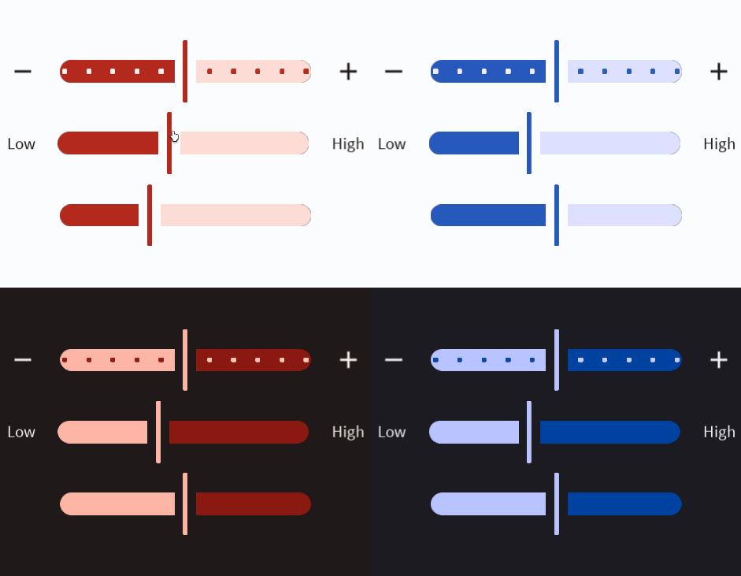

# Slider



A slider allows for the selection of a value within a range. Read more [here](https://m3.material.io/components/sliders/overview).
# Constructors


## new
This function is a native constructor, with verbosity allowing for control over every configurable property at the cost of a less convenient calling.

### Parameters
- **onChange**: (onChange: number) -> ()
- **initialValue**: number
- **minimum**: number?
- **maximum**: number?
- **increment**: number?
- **leftTextOrIcon**: ((string | ImageData)?)
- **rightTextOrIcon**: ((string | ImageData)?)
- **onBackgroundColor**: Color3
- **onBackgroundTextColor**: Color3
- **fillColor**: Color3
- **fillContainerColor**: Color3
- **elevation**: number
- **schemeType**: Enums.SchemeType
- **fontData**: FontData
- **scale**: number


### Usage

**No Framework**
```luau
local onChange: (onChange: number) -> () = function(onChange: number) end
local initialValue: number = 50
local minimum: number? = 0
local maximum: number? = 100
local increment: number? = 10
local leftTextOrIcon: ((string | ImageData)?) = nil
local rightTextOrIcon: ((string | ImageData)?) = nil
local onBackgroundColor: Color3 = Color3.new()
local onBackgroundTextColor: Color3 = Color3.new()
local fillColor: Color3 = Color3.new()
local fillContainerColor: Color3 = Color3.new()
local elevation: number = 0
local schemeType: Enums.SchemeType = Enums.SchemeType.Light
local fontData: FontData = Types.FontData.new(Font.fromEnum(Enum.Font.SourceSans), 14)
local scale: number = 1

local slider = Synthetic.Component.Slider.Fusion.new()
slider.OnChange = onChange
slider.InitialValue = initialValue
slider.Minimum = minimum
slider.Maximum = maximum
slider.Increment = increment
slider.LeftTextOrIcon = leftTextOrIcon
slider.RightTextOrIcon = rightTextOrIcon
slider.OnBackgroundColor = onBackgroundColor
slider.OnBackgroundTextColor = onBackgroundTextColor
slider.FillColor = fillColor
slider.FillContainerColor = fillContainerColor
slider.Elevation = elevation
slider.SchemeType = schemeType
slider.FontData = fontData
slider.Scale = scale
```

**Fusion**
```luau
local onChangeState: Fusion.Value<(onChange: number) -> ()> = Value(function(onChange: number) end)
local initialValue: number = 50
local minimumState: Fusion.Value<number?> = Value(0)
local maximum: number? = 100
local incrementState: Fusion.Value<number?> = Value(10)
local leftTextOrIcon: ((string | ImageData)?) = nil
local rightTextOrIconState: Fusion.Value<((string | ImageData)?)> = Value(nil)
local onBackgroundColor: Color3 = Color3.new()
local onBackgroundTextColorState: Fusion.Value<Color3> = Value(Color3.new())
local fillColor: Color3 = Color3.new()
local fillContainerColorState: Fusion.Value<Color3> = Value(Color3.new())
local elevation: number = 0
local schemeTypeState: Fusion.Value<Enums.SchemeType> = Value(Enums.SchemeType.Light)
local fontData: FontData = Types.FontData.new(Font.fromEnum(Enum.Font.SourceSans), 14)
local scaleState: Fusion.Value<number> = Value(1)

local slider: GuiObject = Synthetic.Component.Slider.Fusion.new(
	onChangeState,
	initialValue,
	minimumState,
	maximum,
	incrementState,
	leftTextOrIcon,
	rightTextOrIconState,
	onBackgroundColor,
	onBackgroundTextColorState,
	fillColor,
	fillContainerColorState,
	elevation,
	schemeTypeState,
	fontData,
	scaleState
)
```
## primary / secondary / tertiary / onPrimary / onSecondary / onTertiary
This function is a style constructor, utilizing the "Style" type to reduce the number of parameters required for implementation.

### Parameters
- **style**: Style
- **onChange**: (onChange: number) -> ()
- **initialValue**: number
- **minimum**: number?
- **maximum**: number?
- **increment**: number?
- **leftTextOrIcon**: ((string | ImageData)?)
- **rightTextOrIcon**: ((string | ImageData)?)
- **elevation**: number?


### Usage

**No Framework**
```luau
local style: Style = Style.new(1, Enum.Font.SourceSans, "Light", Color3.new(0, 0.4, 0.7))
local onChange: (onChange: number) -> () = function(onChange: number) end
local initialValue: number = 50
local minimum: number? = 0
local maximum: number? = 100
local increment: number? = 10
local leftTextOrIcon: ((string | ImageData)?) = nil
local rightTextOrIcon: ((string | ImageData)?) = nil
local elevation: number? = 0

local slider = Synthetic.Component.Slider.Fusion.primary()
slider.Style = style
slider.OnChange = onChange
slider.InitialValue = initialValue
slider.Minimum = minimum
slider.Maximum = maximum
slider.Increment = increment
slider.LeftTextOrIcon = leftTextOrIcon
slider.RightTextOrIcon = rightTextOrIcon
slider.Elevation = elevation
```

**Fusion**
```luau
local styleState: Fusion.Value<Style> = Value(Style.new(1, Enum.Font.SourceSans, "Light", Color3.new(0, 0.4, 0.7)))
local onChange: (onChange: number) -> () = function(onChange: number) end
local initialValueState: Fusion.Value<number> = Value(50)
local minimum: number? = 0
local maximumState: Fusion.Value<number?> = Value(100)
local increment: number? = 10
local leftTextOrIconState: Fusion.Value<((string | ImageData)?)> = Value(nil)
local rightTextOrIcon: ((string | ImageData)?) = nil
local elevationState: Fusion.Value<number?> = Value(0)

local slider: GuiObject = Synthetic.Component.Slider.Fusion.primary(
	styleState,
	onChange,
	initialValueState,
	minimum,
	maximumState,
	increment,
	leftTextOrIconState,
	rightTextOrIcon,
	elevationState
)
```